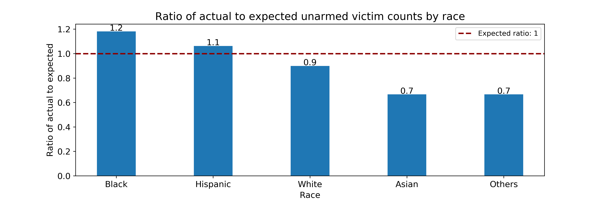

# Exploring racial disparities in police killings in the US

Prepared as a part of the course - DATA 512 Human-Centered Data Science

Pradeep Prabhakar
MSDS, University of Washington
prdp1992@uw.edu

## Abstract

This project analyzed police killings in the US between 2013 and 2019 for racial disparities, if any, at a nation level and across states. Understanding the impact of police killings across different racial/ethnic groups has a strong human centered outlook which served as the primary motivation. We first wanted to understand if individuals in minority racial/ethnic groups are disproportionately killed by the police. We observed that the distribution of killings across races differed significantly from the expected distribution based on arrests estimates, and Blacks and Asians are killed at a rate higher than expected. We then focused on whether unarmed individuals in minority racial/ethnic groups are disproportionately killed by the police and observed that the distribution of unarmed killings across races differed significantly from the expected distribution. Blacks and Hispanics are killed at a higher rate than expected despite being unarmed. We also observed racial disparity across states in the US where on an average, Native Americans, Pacific Islanders and Blacks have a victim rate per million population much higher than the national average. The Black-White disparity was observed in 44 of the 50 states, with Utah having the largest difference between Black and White victim rates.

## Data

The input files downloaded from the websites mentioned below are placed inside the data folder. Following are the sources:

* [mappingpoliceviolence.org](https://mappingpoliceviolence.org/aboutthedata) – a research collaborative that collects comprehensive data on police killings nationwide in the US

Following are some of the attributes found in the police killings data

| Attributes                                                                        |
|-----------------------------------------------------------------------------------|
| Victim's name                                                                     |
| Victim's age                                                                      |
| Victim's gender                                                                   |
| Victim's race                                                                     |
| URL of image of victim                                                            |
| Date of Incident (month/day/year)                                                 |
| Street Address of Incident                                                        |
| City                                                                              |
| State                                                                             |
| Zipcode                                                                           |
| County                                                                            |
| Cause of death                                                                    |
| A brief description of the circumstances   surrounding the death                  |
| Official disposition of death (justified   or other)                              |
| Criminal Charges                                                                  |
| Link to news article or photo of official   document                              |
| Symptoms of mental illness?                                                       |
| Unarmed/Did Not Have an Actual Weapon                                             |
| Alleged Weapon (Source: WaPo and Review of Cases Not Included in WaPo Database)   |
| Alleged Threat Level (Source: WaPo)                                               |
| Fleeing (Source: WaPo)                                                            |
| Body Camera (Source: WaPo)                                                        |
| Off-Duty Killing?                                                                 |
| Geography                                                                         |

* [US Census Bureau](https://www.census.gov/en.html) – provides population estimates for demographic profiles such as age, gender and race at state and nation level.

* [Uniform Crime Reporting](https://www.fbi.gov/services/cjis/ucr/) - The FBI’s Uniform Crime Reporting (UCR) provides arrests estimates at a nation level by race and ethnicity. The arrests data will be used as a benchmark to analyze racial disparity in the killings.

While the license for the datasets are not explicitly mentioned on the website, they are available for the public to download freely.

## Research questions explored

* Are individuals in minority racial/ethnic groups likely to be killed by the police disproportionately? 
    * Null Hypothesis: Rate of police killings across the races are consistent with the rate of crime arrests across the races
* Are individuals in minority racial/ethnic groups likely to be killed by the police disproportionately when unarmed during an encounter? 
    * Null Hypothesis: Rate of police killings involving unarmed victims across races are consistent with the rate of overall police killings across the races
* Are individuals in minority racial/ethnic groups disproportionately killed by the police across the states?
	* Which states exhibit a high degree of racial disparity in police killings, if any?

## Key Findings

* Asians are killed by the police at a rate 1.3 times higher than expected and for Blacks it is 1.3 times higher

* An unarmed black or African American is likely to be killed at a rate ~20% more than expected, while for Hispanics it is higher by ~10%

* Across the states, Pacific Islanders, Native Americans and Blacks are killed at a rate much higher than the national mean of 3.7 /million

## Output files created

For each research question, a summary table and a few output plots are created inside the output folder

## Licenses:

This project is licensed under the terms of the [MIT license](https://github.com/Pradeepprabhakar92/data-512-final/blob/main/LICENSE)
